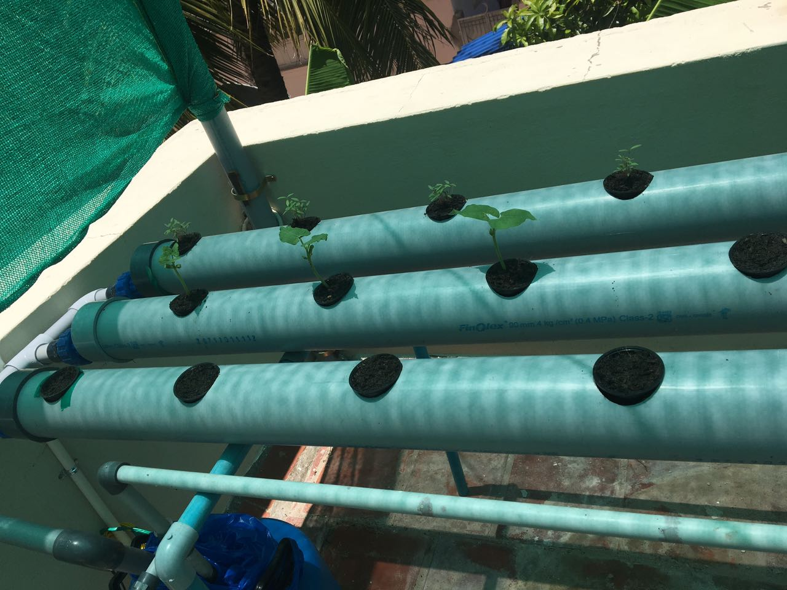

Recently installed the hydrophonic in our house.

 Low rain has caused to drought in tamilnadu.Some of newer plants in garden died during te drougt .Many were refused to work the farm .
Added that many fertile land convert into plot.
 Nowadays ,getting fresh farm produce  is very rare.There is plenty of GMO fruits,vegetables and grains import from foreign countries
 .Even in rural area also GMO product continued to thrive.
 
 Healthier alternative to GMO is hydrophonics.It does not require sand,chemicals and even use less amount of water .It also need small area.
 
 This time my brother vacation was speacial.He spent his part of hoilday installing hydrophonics.Fisrt week dedicated to meterial purchase .Some items ordered from online store.Next week plant started to grow.consequtive week leaf harvested.
 
 we enjoy trying out new recipes with leaf grown from our hydophonics.He credited to today speacial lunch .

[Ready to harvest](https://www.youtube.com/watch?v=4AKDuiKyVMo&feature=youtu.be)

[Hydrophonics@adirai](https://www.facebook.com/mohammed.abubacker.94/videos/472036246504260/)

