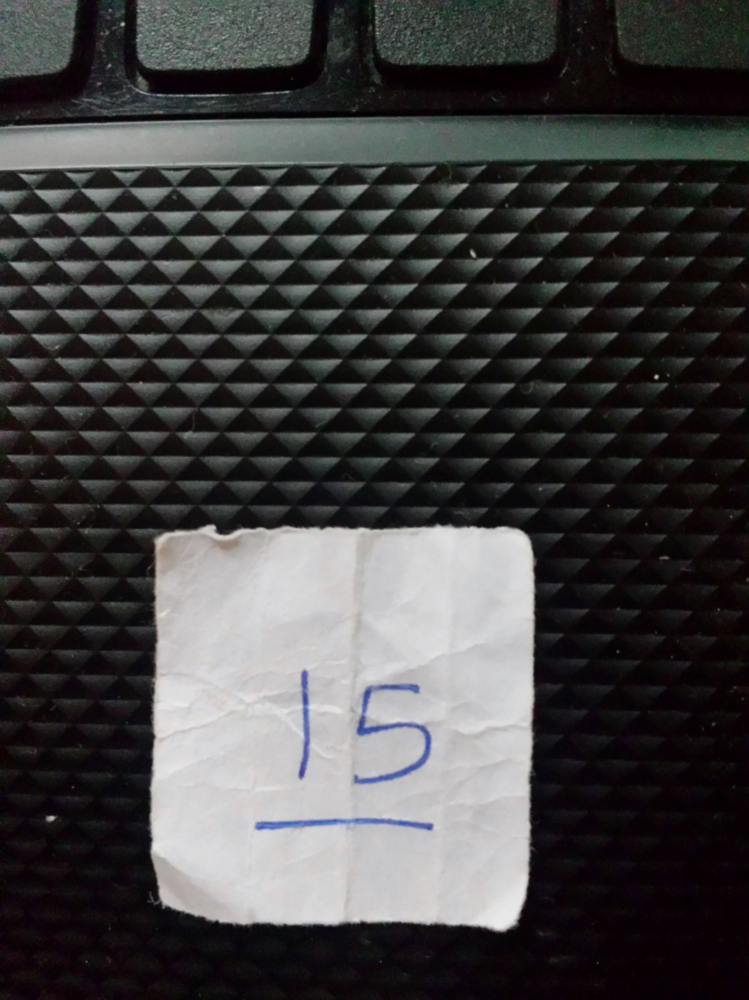

Nowadays international money transfer is simplified because of latest technology.In short period well known commercial bank started the remittance branches all over the kingdom.Their excellent service drawing my attention.so I open the new account.Since then I enjoy the service provided.Albeit other financial institute giving competitive rate I don't shift my mind and keep sending through them.
  After two years of customer my ATM card expired today.So I visit the bank to renew my card.Once entered the bank I have been blocked by security .He Guided me to get counter token from manager who  sit inside the glass cubicle.He gave me handwritten token no "15".As soon I received the token go to waiting area.There I saw token no 6 is serving at 10 am.So many customer were already in queue for their turn.I am also waiting until my turn for an hour.Still token no 6 was serving .There I saw some customer reach the  counter to enquire about delayed process.unfortunately staff not help them out.In between so many new  client coming to bank and approach counter directly with help of manager.Meanwhile old gentleman with token no 15 waiting for turn hopefully.In that moment token no 13 is serving at 12 noon.In one moment he lose the temper and go to counter to process his application.Unfortunately staff refused to do so and divert him come after noon prayer.This poor man left the bank silently as he cannot do anything with this people.Before left the bank he talked to me about stop the transaction with them as they not dealing old customer like him.But I still wait for my turn.Already they closed token display so fed up.So I approach security and explain the situation faced upto now.He understand but couldn't do any help.Immediately go to manger where talked about not process my application till now.I asked him why not caring old customers instead entertaining new customers.He struggle to answer and dialed the nearest counter staff to process my apps.Then I go to staff where he already serving multiple new client altogather.I just give my application where he accept and process my application as requested by manager.After five minutes all the job done for me.So all my angry like ocean storm come to end.

